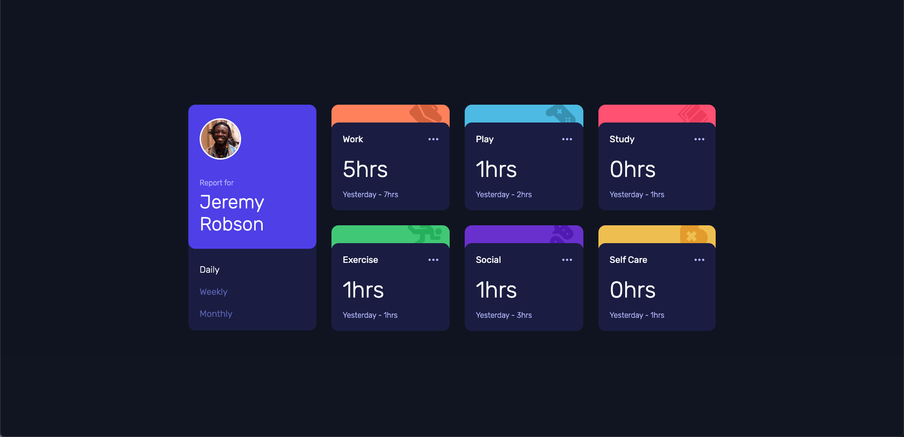

# Frontend Mentor - Time tracking dashboard solution

## Table of contents 目錄

- [Overview 概述](#overview-概述)
  - [The challenge 挑戰](#the-challenge-挑戰)
  - [Screenshot 截圖](#screenshot-截圖)
  - [Links 連結](#links-連結)
- [My process 開發過程](#my-process-開發過程)
  - [Built with 使用的技術](#built-with-使用的技術)
  - [What I learned 學習心得](#what-i-learned-學習心得)
  - [Continued development 持續開發](#continued-development-持續開發)
- [Author 作者](#author-作者)

## Overview 概述

### The challenge 挑戰

Users should be able to: 用戶應該能夠：

- View the optimal layout for the site depending on their device's screen size
  根據設備屏幕大小查看最佳佈局
- See hover states for all interactive elements on the page
  查看頁面上所有交互元素的懸停狀態
- Switch between viewing Daily, Weekly, and Monthly stats
  在每日、每週和每月統計數據之間切換

### Screenshot 截圖



### Links 連結

- Solution URL: [https://github.com/ylin320/Time-tracking-dashboard]
- Live Site URL: [https://ylin320.github.io/Time-tracking-dashboard/]

## My process 開發過程

### Built with 使用的技術

- Semantic HTML5 markup
- CSS custom properties
- Flexbox
- CSS Grid
- Mobile-first workflow
- Vanilla JavaScript
- Fetch API for data handling
- CSS Media Queries for responsive design

### What I learned 學習心得

During this project, I gained valuable experience with the Fetch API and improved my JavaScript skills. Here are some key learnings:

在這個項目中，我獲得了使用 Fetch API 的寶貴經驗，並提高了 JavaScript 技能。以下是一些主要學習內容：

```javascript
// 實際項目中的 Fetch API 實現
fetch("./data.json")
  .then((res) => res.json())
  .then((data) => {
    ...
  })
  .catch((err) => {
    console.error("Error:", err);
  });
```

Key learnings 主要學習內容：

1. Understanding asynchronous operations with Fetch API and Promises
   理解 Fetch API 和 Promise 的異步操作
2. DOM manipulation and event handling for interactive elements
   交互元素的 DOM 操作和事件處理
3. Responsive design implementation using CSS Grid and Media Queries
   使用 CSS Grid 和 Media Queries 實現響應式設計
4. Data structure handling and dynamic content updates
   數據結構處理和動態內容更新
5. Error handling in data fetching operations
   數據獲取操作中的錯誤處理

### Continued development 持續開發

Areas I want to focus on in future projects: 未來項目中想要關注的領域：

1. Advanced CSS Grid layouts and animations
   高級 CSS Grid 佈局和動畫
2. Performance optimization for data fetching
   數據獲取的性能優化
3. Accessibility improvements
   可訪問性改進
4. Testing implementation
   測試實現

## Author 作者

- GitHub - [@ylin320](https://github.com/ylin320)
- Frontend Mentor - [@ylin320](https://www.frontendmentor.io/profile/ylin320)
